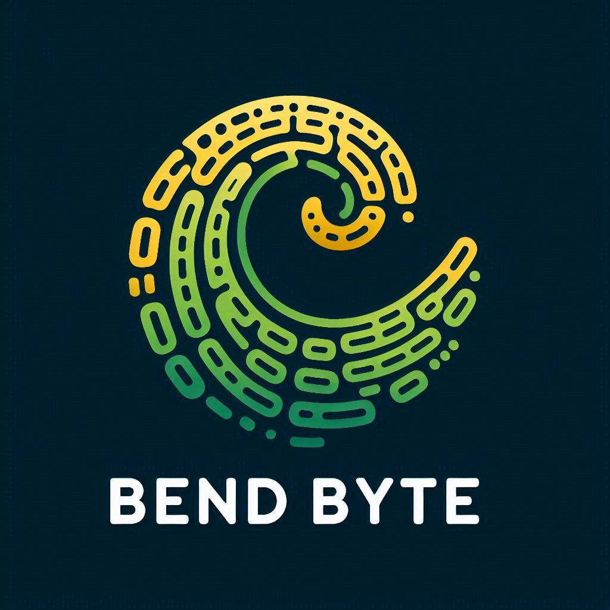

# BendByte Inc.

## Links Úteis

<table>
  <tr>
    <td>
      
    </td>
    <td>
      <a href="https://clickup.com" target="_blank">ClickUp</a>
    </td>
  </tr>
  <tr>
    <td>
      
    </td>
    <td>
      <a href="https://discord.com" target="_blank">Discord</a>
    </td>
  </tr>
  <tr>
    <td>
      
    </td>
    <td><a href="https://drive.google.com" target="_blank">Google Drive</a>
    </td>
  </tr>
</table>

## Description

```json
{
  "name": "BendByte",
  "domains": ["https://bendbyte.com", "https://bendbytes.com"],
  "lore": {
    "initial_date" "01/01/2025",
    "background_history": "Nós temos dominação e manipulação do cyberespaço, bla bla bla,"
  },
  "Partners/Associates": ["Bruno", "Diego", "Lucas"],
  "Masterminded By" "Luidiblu Technology * Cópia Não Comédia"
}
```

